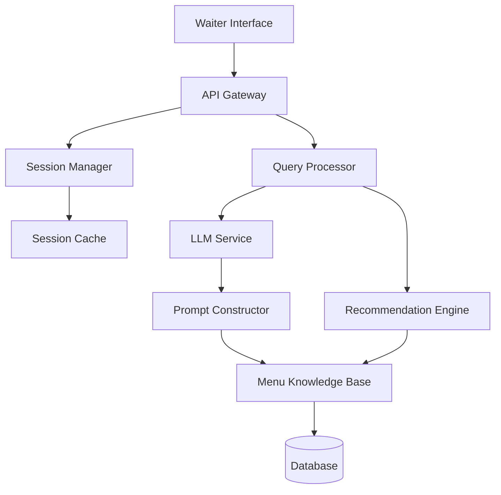

# Design Document: AI-Powered Restaurant Assistant (Phase 1)

## Overview

The AI-Powered Restaurant Assistant (Phase 1) is a waiter-facing intelligent system that provides real-time culinary knowledge and recommendations during customer service. The system architecture follows a layered approach with clear separation between the user interface, business logic, AI processing, and data storage layers.

### Key Design Principles

1. **Responsiveness**: All user-facing operations must complete within 2-4 seconds to maintain service flow
2. **Context Awareness**: Maintain conversation context within sessions to enable natural interactions
3. **Extensibility**: Design for future phases including customer profiles and cross-restaurant analytics
4. **Reliability**: Graceful degradation when components fail to ensure waiters can continue service
5. **Simplicity**: Minimize cognitive load on waitstaff with clear, actionable responses

### Technology Approach

The system uses a modern web-based architecture with:
- **Frontend**: Mobile-responsive web interface for waiter interactions
- **Backend API**: RESTful services for query processing and data retrieval
- **AI Layer**: Large Language Model (LLM) integration for natural language understanding and generation
- **Database**: Structured storage for menu data with fast retrieval capabilities
- **Caching**: In-memory caching for frequently accessed dish information

## Architecture

### System Components



### Component Responsibilities

**Waiter Interface**
- Renders mobile-responsive UI for query input and response display
- Manages local state for current session
- Handles offline caching of recent dish data
- Provides visual feedback during processing

**API Gateway**
- Routes requests to appropriate backend services
- Handles authentication and authorization
- Implements rate limiting and request validation
- Manages API versioning

**Session Manager**
- Creates and maintains session contexts for each table
- Tracks customer preferences and conversation history within sessions
- Provides session isolation between different tables
- Handles session lifecycle (creation, updates, archival)

**Query Processor**
- Interprets natural language queries from waiters
- Extracts intent and entities from queries
- Resolves contextual references using session data
- Coordinates with LLM Service for complex understanding tasks

**LLM Service**
- Provides natural language understanding capabilities
- Generates human-like responses to queries
- Handles ambiguity resolution and clarification
- Processes complex reasoning tasks (e.g., pairing suggestions)

**Recommendation Engine**
- Ranks dishes based on customer preferences
- Applies filtering for dietary restrictions
- Considers flavor profiles and cuisine types
- Generates explanations for recommendations

**Menu Knowledge Base**
- Provides fast access to dish information
- Manages CRUD operations for menu data
- Maintains data consistency and validation
- Supports structured queries for filtering and search

**Prompt Constructor**
- Builds context-rich prompts for the LLM
- Includes relevant dish information and session context
- Formats prompts according to LLM requirements
- Manages prompt templates for different query types


### Data Flow

**Query Processing Flow**:
1. Waiter submits query through Waiter Interface
2. API Gateway validates and routes request to Query Processor
3. Query Processor retrieves session context from Session Manager
4. Query Processor analyzes query intent and extracts entities
5. For recommendation queries: Recommendation Engine filters and ranks dishes
6. For information queries: Menu Knowledge Base retrieves dish details
7. Prompt Constructor builds LLM prompt with context and data
8. LLM Service generates natural language response
9. Response formatted and returned to Waiter Interface
10. Session Manager updates session context with query and response

**Session Management Flow**:
1. Waiter initiates service for a table
2. Session Manager creates new session with unique ID
3. All queries include session ID for context retrieval
4. Session Manager maintains preference list and conversation history
5. When table service completes, session archived to database

## Components and Interfaces

### Waiter Interface Component

**Purpose**: Provide intuitive mobile interface for waitstaff to interact with AI Assistant

**Key Features**:
- Text input with autocomplete for common queries
- Quick action buttons for frequent tasks (allergen check, recommendations)
- Session selector for managing multiple tables
- Response display with formatted text and visual highlights
- Offline mode with cached dish data

**Interface Contracts**:

```typescript
interface WaiterInterfaceAPI {
  submitQuery(sessionId: string, query: string): Promise<QueryResponse>
  createSession(tableNumber: string, customerCount: number): Promise<Session>
  endSession(sessionId: string): Promise<void>
  addPreference(sessionId: string, customerId: string, preference: Preference): Promise<void>
}

interface QueryResponse {
  responseText: string
  formattedData?: FormattedDishInfo | RecommendationList
  processingTime: number
  clarificationNeeded?: string
}
```

### Query Processor Component

**Purpose**: Interpret natural language queries and coordinate response generation

**Query Types Supported**:
- **Information Queries**: "What's in the Caesar salad?"
- **Allergen Queries**: "Does the pasta have nuts?"
- **Recommendation Queries**: "What should I recommend for someone who likes spicy food?"
- **Pairing Queries**: "What wine goes with the salmon?"
- **Substitution Queries**: "Can we make the curry without shrimp?"

**Processing Pipeline**:
1. **Intent Classification**: Determine query type (information, recommendation, pairing, etc.)
2. **Entity Extraction**: Identify dish names, ingredients, preferences, restrictions
3. **Context Resolution**: Resolve pronouns and references using session context
4. **Data Retrieval**: Fetch relevant dish information from Menu Knowledge Base
5. **Response Generation**: Construct prompt and call LLM Service
6. **Post-Processing**: Format response and extract structured data

**Interface Contracts**:

```typescript
interface QueryProcessor {
  processQuery(query: string, sessionContext: SessionContext): Promise<ProcessedQuery>
}

interface ProcessedQuery {
  intent: QueryIntent
  entities: Entity[]
  resolvedReferences: Map<string, string>
  relevantDishes: Dish[]
  requiresClarification: boolean
  clarificationQuestion?: string
}

enum QueryIntent {
  DISH_INFORMATION,
  ALLERGEN_CHECK,
  RECOMMENDATION,
  PAIRING_SUGGESTION,
  SUBSTITUTION,
  DIETARY_FILTER
}

interface Entity {
  type: EntityType
  value: string
  confidence: number
}

enum EntityType {
  DISH_NAME,
  INGREDIENT,
  ALLERGEN,
  CUISINE_TYPE,
  FLAVOR_PREFERENCE,
  DIETARY_RESTRICTION,
  SPICE_LEVEL
}
```


### Menu Knowledge Base Component

**Purpose**: Store and retrieve comprehensive dish information with fast query performance

**Data Operations**:
- **Create**: Add new dishes with validation
- **Read**: Retrieve dish information by ID or name
- **Update**: Modify dish details with version tracking
- **Delete**: Remove dishes (soft delete with archival)
- **Search**: Find dishes by ingredients, allergens, or attributes
- **Filter**: Apply dietary restriction filters

**Interface Contracts**:

```typescript
interface MenuKnowledgeBase {
  getDish(dishId: string): Promise<Dish>
  getDishByName(name: string): Promise<Dish | null>
  searchDishes(criteria: SearchCriteria): Promise<Dish[]>
  filterByDietaryRestrictions(restrictions: DietaryRestriction[]): Promise<Dish[]>
  addDish(dish: DishInput): Promise<Dish>
  updateDish(dishId: string, updates: Partial<DishInput>): Promise<Dish>
  deleteDish(dishId: string): Promise<void>
}

interface SearchCriteria {
  cuisineType?: string[]
  courseType?: string[]
  excludeAllergens?: string[]
  includeIngredients?: string[]
  flavorProfile?: FlavorProfile
  maxSpiceLevel?: number
}
```

### Recommendation Engine Component

**Purpose**: Generate personalized dish recommendations based on customer preferences

**Recommendation Algorithm**:
1. **Filtering Phase**: Remove dishes that violate dietary restrictions or allergen constraints
2. **Scoring Phase**: Assign scores based on preference matching
   - Flavor profile similarity: 40% weight
   - Cuisine familiarity: 25% weight
   - Spice level match: 20% weight
   - Novelty factor: 15% weight
3. **Ranking Phase**: Sort dishes by score and select top N
4. **Explanation Generation**: Create human-readable reasons for each recommendation

**Interface Contracts**:

```typescript
interface RecommendationEngine {
  recommendDishes(
    preferences: CustomerPreferences,
    availableDishes: Dish[],
    count: number
  ): Promise<Recommendation[]>
  
  recommendForGroup(
    groupPreferences: CustomerPreferences[],
    availableDishes: Dish[],
    count: number
  ): Promise<Recommendation[]>
}

interface Recommendation {
  dish: Dish
  score: number
  explanation: string
  matchFactors: MatchFactor[]
}

interface CustomerPreferences {
  customerId?: string
  dietaryRestrictions: DietaryRestriction[]
  allergens: string[]
  flavorPreferences: FlavorProfile
  spiceTolerance: number
  cuisineFamiliarity: string[]
  adventurousness: number
}
```

### Session Manager Component

**Purpose**: Maintain conversation context and customer preferences during table service

**Interface Contracts**:

```typescript
interface SessionManager {
  createSession(tableNumber: string, customerCount: number): Promise<Session>
  getSession(sessionId: string): Promise<Session>
  updateSession(sessionId: string, updates: SessionUpdate): Promise<Session>
  endSession(sessionId: string): Promise<void>
  addCustomerPreference(sessionId: string, customerId: string, preference: Preference): Promise<void>
  getSessionContext(sessionId: string): Promise<SessionContext>
}

interface Session {
  sessionId: string
  tableNumber: string
  customerCount: number
  customers: Customer[]
  conversationHistory: ConversationEntry[]
  createdAt: Date
  lastActivityAt: Date
  status: SessionStatus
}
```

### LLM Service Component

**Purpose**: Provide natural language understanding and generation capabilities

**LLM Integration Strategy**:
- Use OpenAI GPT-4 or similar LLM via API
- Implement prompt templates for consistent formatting
- Include few-shot examples for better response quality
- Set temperature and token limits based on query type
- Implement retry logic with exponential backoff

**Interface Contracts**:

```typescript
interface LLMService {
  generateResponse(prompt: string, options: LLMOptions): Promise<LLMResponse>
  classifyIntent(query: string): Promise<QueryIntent>
  extractEntities(query: string): Promise<Entity[]>
}

interface LLMOptions {
  temperature: number
  maxTokens: number
  stopSequences?: string[]
  systemPrompt?: string
}
```


## Data Models

### Dish Model

```typescript
interface Dish {
  dishId: string
  name: string
  description: string
  cuisineType: string
  courseType: CourseType
  ingredients: Ingredient[]
  allergens: string[]
  preparationMethod: string
  preparationTime: number
  flavorProfile: FlavorProfile
  spiceLevel: number
  dietaryClassifications: DietaryClassification[]
  pairings: Pairing[]
  price: number
  available: boolean
  createdAt: Date
  updatedAt: Date
}

interface Ingredient {
  name: string
  quantity?: string
  isAllergen: boolean
  isOptional: boolean
  substitutions: string[]
}

interface FlavorProfile {
  sweet: number
  salty: number
  sour: number
  bitter: number
  umami: number
  spicy: number
  richness: number
}

enum CourseType {
  APPETIZER,
  SOUP,
  SALAD,
  MAIN_COURSE,
  SIDE_DISH,
  DESSERT,
  BEVERAGE
}

enum DietaryClassification {
  VEGETARIAN,
  VEGAN,
  GLUTEN_FREE,
  DAIRY_FREE,
  NUT_FREE,
  SHELLFISH_FREE,
  HALAL,
  KOSHER
}
```

### Session Model

```typescript
interface Session {
  sessionId: string
  tableNumber: string
  customerCount: number
  customers: Customer[]
  conversationHistory: ConversationEntry[]
  createdAt: Date
  lastActivityAt: Date
  status: SessionStatus
}

interface Customer {
  customerId: string
  preferences: CustomerPreferences
  notes: string[]
}

interface CustomerPreferences {
  customerId: string
  dietaryRestrictions: DietaryRestriction[]
  allergens: string[]
  flavorPreferences: FlavorProfile
  spiceTolerance: number
  cuisineFamiliarity: string[]
  adventurousness: number
  notes: string[]
}

enum DietaryRestriction {
  VEGETARIAN,
  VEGAN,
  GLUTEN_FREE,
  DAIRY_FREE,
  NUT_FREE,
  SHELLFISH_FREE,
  LOW_CARB,
  KETO,
  PALEO
}
```


## Correctness Properties

*A property is a characteristic or behavior that should hold true across all valid executions of a system—essentially, a formal statement about what the system should do. Properties serve as the bridge between human-readable specifications and machine-verifiable correctness guarantees.*

### Property 1: Dish Data Round-Trip Consistency

*For any* valid dish object with all required fields (name, description, ingredients, preparation method, allergens, flavor profile), storing it in the Menu Knowledge Base and then retrieving it should return an equivalent dish object with all fields preserved.

**Validates: Requirements 1.1**

### Property 2: Required Field Validation

*For any* dish object missing one or more required fields (name, description, ingredients, preparation method, allergens, or flavor profile), attempting to add it to the Menu Knowledge Base should be rejected with a validation error.

**Validates: Requirements 1.2**

### Property 3: Update History Preservation

*For any* dish in the Menu Knowledge Base, after performing any number of updates, the update history should contain all updates in chronological order with valid timestamps, and the current dish state should reflect the most recent update.

**Validates: Requirements 1.3**

### Property 4: Dietary Restriction Filtering

*For any* set of dishes and any dietary restriction (vegetarian, vegan, gluten-free, dairy-free, nut-free), filtering the dishes by that restriction should return only dishes that comply with the restriction, and all non-compliant dishes should be excluded.

**Validates: Requirements 4.1**

### Property 5: Allergen Completeness

*For any* dish with allergens, when querying for dish information, the response should include all allergens present in the dish's ingredient list, with no allergens omitted.

**Validates: Requirements 3.3**

### Property 6: Cross-Contamination Warning

*For any* dish query where severe allergens are specified in customer preferences, if the dish or its preparation involves cross-contamination risks, the response should include an explicit cross-contamination warning.

**Validates: Requirements 4.5**

### Property 7: Recommendation Ranking Consistency

*For any* set of customer preferences and available dishes, recommendations should be ranked such that dishes with higher flavor profile similarity, appropriate spice levels, and matching cuisine familiarity score higher than dishes with lower matches in these factors.

**Validates: Requirements 5.1, 5.2**

### Property 8: Adventurousness Affects Novelty

*For any* two identical preference sets differing only in adventurousness score, the recommendations for the high adventurousness customer should include more novel/unique dishes than the recommendations for the low adventurousness customer.

**Validates: Requirements 5.3, 5.4**

### Property 9: Minimum Recommendation Count

*For any* menu with at least 3 available dishes that pass dietary restriction filters, the recommendation engine should return at least 3 recommendations.

**Validates: Requirements 5.5**

### Property 10: Pairing Menu Availability

*For any* dish, all pairing suggestions (appetizers, sides, beverages) returned by the system should be items that currently exist in the menu and are marked as available.

**Validates: Requirements 6.5**

### Property 11: Session State Persistence

*For any* active session, adding customer preferences or recording discussed dishes should preserve that information across subsequent queries within the same session, and retrieving session context should return all previously stored preferences and discussed dishes.

**Validates: Requirements 7.2**

### Property 12: Session Isolation

*For any* two concurrent sessions with different session IDs, preferences and context stored in one session should not appear in or affect the other session's context.

**Validates: Requirements 7.4**

### Property 13: Session Archival

*For any* active session, when the session is ended, the session data should be archived and retrievable, with all preferences, conversation history, and metadata preserved.

**Validates: Requirements 7.5**

### Property 14: Multi-Customer Preference Isolation

*For any* session with multiple customers, preferences added for one customer should be stored separately and should not be mixed with or overwrite preferences for other customers in the same session.

**Validates: Requirements 8.1, 8.2**

### Property 15: Group Recommendation Accommodation

*For any* group of customers with different dietary restrictions, group recommendations should return only dishes that satisfy all members' dietary restrictions simultaneously.

**Validates: Requirements 8.3, 8.4**

### Property 16: Response Completeness

*For any* recommendation response, each recommendation should include the dish name, description, and an explanation of why it matches the customer's preferences.

**Validates: Requirements 9.3**

### Property 17: Allergen Highlighting

*For any* dish information response that includes ingredients, all ingredients marked as allergens should be visually distinguished in the formatted output.

**Validates: Requirements 9.2**

### Property 18: Graceful Incomplete Data Handling

*For any* dish with incomplete information (missing optional fields), querying that dish should return the available information along with a note indicating which fields are missing, rather than failing or returning incorrect data.

**Validates: Requirements 10.3**

### Property 19: Error Logging

*For any* error that occurs during query processing, the system should log the error with timestamp, error type, and relevant context information before returning an error response to the user.

**Validates: Requirements 10.5**

### Property 20: Cache Consistency

*For any* dish accessed through the interface, the dish information should be stored in the local cache, and subsequent requests for the same dish should be retrievable from cache with identical data.

**Validates: Requirements 11.5**

### Property 21: Context Reference Resolution

*For any* query containing contextual references (pronouns like "it", "this dish", "they"), if the session context contains previously discussed dishes or customers, the query processor should resolve the reference to the correct entity from the session context.

**Validates: Requirements 2.4, 7.3**

### Property 22: Intent and Entity Extraction

*For any* valid natural language query about dishes, the query processor should extract at least one intent (information, recommendation, pairing, etc.) and relevant entities (dish names, ingredients, preferences) with confidence scores.

**Validates: Requirements 2.1**


## Error Handling

### Error Categories

**1. Validation Errors**
- Invalid dish data (missing required fields)
- Invalid session data (missing customer count, invalid table number)
- Invalid query format (empty queries, excessively long queries)

**Response Strategy**: Return clear error message indicating which validation failed and what is required.

**2. Data Not Found Errors**
- Dish not found by name or ID
- Session not found by ID
- Customer not found in session

**Response Strategy**: Return specific "not found" message and suggest alternatives (e.g., similar dish names, active sessions).

**3. External Service Errors**
- LLM API unavailable or timeout
- Database connection failure
- Cache service unavailable

**Response Strategy**: Implement retry logic with exponential backoff (3 retries). If all retries fail, return graceful degradation response with cached data or manual consultation suggestion.

**4. Business Logic Errors**
- No dishes meet dietary restrictions
- Ambiguous query requiring clarification
- Insufficient data for recommendations

**Response Strategy**: Return informative message explaining the situation and provide actionable next steps.

### Error Response Format

```typescript
interface ErrorResponse {
  error: {
    code: string
    message: string
    details?: any
    suggestions?: string[]
    retryable: boolean
  }
  timestamp: Date
  requestId: string
}
```

### Logging Strategy

**Log Levels**:
- **ERROR**: System failures, external service failures, unexpected exceptions
- **WARN**: Business logic errors, validation failures, degraded performance
- **INFO**: Successful requests, session lifecycle events
- **DEBUG**: Detailed processing steps, LLM prompts and responses

**Log Contents**:
- Timestamp
- Request ID (for tracing)
- Session ID (if applicable)
- Error type and message
- Stack trace (for exceptions)
- User action context
- Performance metrics (response time)

### Retry and Timeout Configuration

**LLM Service**:
- Timeout: 10 seconds
- Retries: 3 attempts with exponential backoff (1s, 2s, 4s)
- Fallback: Return cached response or suggest manual consultation

**Database Queries**:
- Timeout: 2 seconds
- Retries: 2 attempts with 500ms backoff
- Fallback: Use cached data if available

**Cache Operations**:
- Timeout: 500ms
- Retries: 1 attempt
- Fallback: Proceed without cache (fetch from database)


## AWS Deployment Architecture

### Overview

The AI-Powered Restaurant Assistant will be deployed on AWS using a serverless-first architecture to ensure scalability, cost-efficiency, and minimal operational overhead. The deployment leverages managed services for compute, storage, caching, and AI capabilities.

### AWS Service Mapping

**Frontend Hosting**:
- **Amazon S3**: Static asset hosting for web interface
- **Amazon CloudFront**: CDN for global content delivery with edge caching
- **AWS Certificate Manager**: SSL/TLS certificates for HTTPS

**API Layer**:
- **Amazon API Gateway**: RESTful API management with request validation, throttling, and API keys
- **AWS Lambda**: Serverless compute for API handlers and business logic
- **AWS Lambda Layers**: Shared dependencies and utility functions

**AI and ML Services**:
- **Amazon Bedrock**: LLM integration (Claude, Titan, or other foundation models)
- **Amazon SageMaker** (optional): Custom model hosting if needed for specialized tasks
- **AWS Lambda**: Prompt construction and response processing

**Data Storage**:
- **Amazon DynamoDB**: Primary database for menu data, sessions, and customer preferences
  - On-demand billing for variable workloads
  - Global tables for multi-region support (future)
  - Point-in-time recovery enabled
- **Amazon S3**: Long-term archival of session data and analytics

**Caching Layer**:
- **Amazon ElastiCache (Redis)**: In-memory caching for frequently accessed dishes and session data
- **API Gateway Caching**: Response caching for common queries

**Authentication and Authorization**:
- **Amazon Cognito**: User authentication for waitstaff
- **AWS IAM**: Service-to-service authorization
- **API Gateway Authorizers**: Request validation and access control

**Monitoring and Logging**:
- **Amazon CloudWatch**: Centralized logging and metrics
- **AWS X-Ray**: Distributed tracing for request flows
- **CloudWatch Alarms**: Automated alerting for errors and performance issues

**Infrastructure as Code**:
- **AWS CDK** or **AWS SAM**: Infrastructure provisioning and deployment automation
- **AWS CloudFormation**: Underlying infrastructure management

### Architecture Diagram

```
┌─────────────────────────────────────────────────────────────────┐
│                         CloudFront (CDN)                         │
│                    SSL/TLS, Edge Caching                         │
└────────────────────────────┬────────────────────────────────────┘
                             │
                ┌────────────┴────────────┐
                │                         │
        ┌───────▼────────┐       ┌───────▼────────┐
        │   S3 Bucket    │       │  API Gateway   │
        │ (Static Site)  │       │  (REST API)    │
        └────────────────┘       └───────┬────────┘
                                         │
                        ┌────────────────┼────────────────┐
                        │                │                │
                ┌───────▼──────┐  ┌──────▼──────┐  ┌─────▼──────┐
                │   Lambda     │  │   Lambda    │  │  Lambda    │
                │ (Query Proc) │  │  (Session)  │  │   (Menu)   │
                └───────┬──────┘  └──────┬──────┘  └─────┬──────┘
                        │                │                │
                        └────────────────┼────────────────┘
                                         │
                        ┌────────────────┼────────────────┐
                        │                │                │
                ┌───────▼──────┐  ┌──────▼──────┐  ┌─────▼──────┐
                │   Bedrock    │  │  DynamoDB   │  │ElastiCache │
                │    (LLM)     │  │  (Tables)   │  │   (Redis)  │
                └──────────────┘  └──────┬──────┘  └────────────┘
                                         │
                                  ┌──────▼──────┐
                                  │      S3     │
                                  │  (Archive)  │
                                  └─────────────┘
```

### DynamoDB Table Design

**Dishes Table**:
- Partition Key: `dishId` (String)
- Attributes: name, description, ingredients, allergens, flavorProfile, etc.
- GSI: `name-index` for dish name lookups
- GSI: `cuisineType-index` for filtering by cuisine

**Sessions Table**:
- Partition Key: `sessionId` (String)
- Sort Key: `timestamp` (Number)
- Attributes: tableNumber, customers, conversationHistory, status
- TTL: Auto-delete archived sessions after 90 days
- GSI: `tableNumber-status-index` for active session lookups

**CustomerPreferences Table** (Phase 2):
- Partition Key: `customerId` (String)
- Attributes: dietaryRestrictions, allergens, flavorPreferences, orderHistory
- GSI: `phoneNumber-index` for customer lookup by phone

### Lambda Function Organization

**Query Processor Lambda**:
- Runtime: Node.js 18.x or Python 3.11
- Memory: 1024 MB
- Timeout: 30 seconds
- Environment Variables: BEDROCK_MODEL_ID, DYNAMODB_TABLE_NAMES, REDIS_ENDPOINT
- Layers: Shared utilities, AWS SDK extensions

**Session Manager Lambda**:
- Runtime: Node.js 18.x or Python 3.11
- Memory: 512 MB
- Timeout: 10 seconds
- Triggers: API Gateway, EventBridge (for session cleanup)

**Menu Knowledge Base Lambda**:
- Runtime: Node.js 18.x or Python 3.11
- Memory: 512 MB
- Timeout: 10 seconds
- Triggers: API Gateway, S3 (for bulk menu uploads)

**Recommendation Engine Lambda**:
- Runtime: Node.js 18.x or Python 3.11
- Memory: 1024 MB
- Timeout: 15 seconds
- Environment Variables: SCORING_WEIGHTS, FILTER_RULES

### API Gateway Configuration

**Endpoints**:
- `POST /sessions` - Create new session
- `GET /sessions/{sessionId}` - Get session details
- `PUT /sessions/{sessionId}` - Update session
- `DELETE /sessions/{sessionId}` - End session
- `POST /query` - Submit query
- `GET /dishes` - List dishes
- `GET /dishes/{dishId}` - Get dish details
- `POST /dishes` - Add dish (admin)
- `PUT /dishes/{dishId}` - Update dish (admin)

**Request Validation**:
- JSON schema validation for all POST/PUT requests
- Query parameter validation
- Request size limits (10 KB for queries, 100 KB for dish data)

**Throttling**:
- Per-API key: 100 requests/second burst, 50 requests/second steady
- Per-IP: 20 requests/second (unauthenticated)

**Caching**:
- GET /dishes: 5-minute cache
- GET /dishes/{dishId}: 10-minute cache
- POST /query: No caching (dynamic responses)

### Security Configuration

**Network Security**:
- Lambda functions in VPC for ElastiCache access
- Security groups restricting Redis access to Lambda functions only
- DynamoDB accessed via VPC endpoints (no internet routing)

**Data Encryption**:
- DynamoDB encryption at rest (AWS managed keys)
- S3 bucket encryption (SSE-S3)
- ElastiCache encryption in transit and at rest
- API Gateway TLS 1.2+ only

**Access Control**:
- IAM roles with least-privilege permissions for each Lambda
- API Gateway resource policies restricting access
- Cognito user pools for waiter authentication
- API keys for restaurant-level access control

**Secrets Management**:
- AWS Secrets Manager for API keys and credentials
- Lambda environment variables for non-sensitive config
- Automatic secret rotation enabled

### Monitoring and Observability

**CloudWatch Metrics**:
- Lambda invocation count, duration, errors, throttles
- API Gateway request count, latency, 4xx/5xx errors
- DynamoDB read/write capacity, throttled requests
- ElastiCache CPU, memory, cache hit rate
- Bedrock invocation count, token usage, latency

**CloudWatch Logs**:
- Lambda function logs with structured JSON logging
- API Gateway access logs
- VPC Flow Logs for network traffic analysis

**X-Ray Tracing**:
- End-to-end request tracing across Lambda, DynamoDB, Bedrock
- Service map visualization
- Latency analysis and bottleneck identification

**Alarms**:
- Lambda error rate > 5%
- API Gateway 5xx error rate > 1%
- DynamoDB throttled requests > 0
- ElastiCache CPU > 75%
- Bedrock throttling or quota exceeded
- Response time P99 > 4 seconds

### Deployment Pipeline

**CI/CD Workflow**:
1. Code commit triggers AWS CodePipeline
2. CodeBuild runs unit tests and property tests
3. CDK/SAM synthesizes CloudFormation templates
4. Deploy to staging environment
5. Run integration tests and smoke tests
6. Manual approval gate
7. Deploy to production with blue-green deployment
8. Monitor CloudWatch metrics for 15 minutes
9. Automatic rollback on alarm triggers

**Environment Strategy**:
- **Development**: Single-region, minimal resources, on-demand billing
- **Staging**: Production-like setup, separate AWS account
- **Production**: Multi-AZ, auto-scaling, reserved capacity for predictable workloads

### Cost Optimization

**Strategies**:
- Lambda provisioned concurrency only for critical functions
- DynamoDB on-demand billing (Phase 1), migrate to provisioned capacity with auto-scaling (Phase 2+)
- ElastiCache reserved nodes for production (1-year commitment)
- S3 Intelligent-Tiering for archived session data
- CloudFront caching to reduce origin requests
- API Gateway caching to reduce Lambda invocations
- Bedrock request batching where possible

**Estimated Monthly Cost (Phase 1, 10 restaurants, 1000 queries/day)**:
- Lambda: $50-100
- API Gateway: $30-50
- DynamoDB: $20-40
- ElastiCache: $50-80 (t3.micro reserved)
- Bedrock: $100-200 (varies by model and token usage)
- CloudFront: $10-20
- Other services: $20-30
- **Total: ~$280-520/month**

### Scalability Considerations

**Horizontal Scaling**:
- Lambda auto-scales to handle concurrent requests (up to account limits)
- DynamoDB auto-scales read/write capacity based on demand
- ElastiCache cluster mode for horizontal scaling (Phase 2+)
- API Gateway handles millions of requests per second

**Vertical Scaling**:
- Lambda memory can be increased to 10 GB if needed
- ElastiCache node types can be upgraded without downtime

**Geographic Scaling** (Phase 4):
- DynamoDB Global Tables for multi-region replication
- CloudFront edge locations for global content delivery
- Regional Lambda deployments for reduced latency
- Route 53 latency-based routing

### Disaster Recovery

**Backup Strategy**:
- DynamoDB point-in-time recovery (35-day retention)
- Daily snapshots of ElastiCache clusters
- S3 versioning enabled for archived data
- Cross-region replication for critical S3 buckets (Phase 2+)

**Recovery Objectives**:
- **RTO (Recovery Time Objective)**: 1 hour
- **RPO (Recovery Point Objective)**: 5 minutes

**Failover Procedures**:
- Automated failover for DynamoDB and ElastiCache
- Lambda functions are stateless (no failover needed)
- CloudFront automatically routes to healthy origins
- Runbook for manual intervention if needed

## Testing Strategy

### Dual Testing Approach

The system will be validated using both **unit tests** and **property-based tests** to ensure comprehensive coverage:

- **Unit tests** verify specific examples, edge cases, and error conditions
- **Property-based tests** verify universal properties across all inputs
- Both approaches are complementary and necessary for comprehensive correctness validation

### Unit Testing Focus

Unit tests should focus on:
- **Specific examples**: Concrete scenarios that demonstrate correct behavior (e.g., "vegetarian filter excludes chicken dish")
- **Edge cases**: Boundary conditions (e.g., empty menu, single dish, maximum group size)
- **Error conditions**: Invalid inputs, missing data, service failures
- **Integration points**: Component interactions and data flow

**Example Unit Tests**:
- Test that a specific dish with known allergens returns those allergens
- Test that an empty query returns a validation error
- Test that a session with 10 customers (maximum) is created successfully
- Test that ambiguous query "What's good?" triggers clarification request

### Property-Based Testing Focus

Property-based tests should focus on:
- **Universal properties**: Rules that hold for all valid inputs
- **Invariants**: Conditions that remain true across operations
- **Round-trip properties**: Operations that should preserve data
- **Metamorphic properties**: Relationships between inputs and outputs

**Property Test Configuration**:
- **Testing Library**: Use `fast-check` (JavaScript/TypeScript) or `Hypothesis` (Python)
- **Iterations**: Minimum 100 iterations per property test
- **Tagging**: Each property test must reference its design document property
- **Tag Format**: `// Feature: ai-restaurant-assistant, Property {number}: {property_text}`

**Example Property Tests**:
- Property 1: Dish round-trip (store then retrieve preserves all fields)
- Property 4: Dietary filtering (all returned dishes meet restrictions)
- Property 7: Recommendation ranking (higher matches score higher)
- Property 12: Session isolation (concurrent sessions don't interfere)

### Test Data Generation

**For Property Tests**:
- Generate random dishes with varied ingredients, allergens, and flavor profiles
- Generate random customer preferences with different restrictions and tastes
- Generate random queries with different intents and entities
- Generate random session contexts with multiple customers

**Generators Should Include**:
- Valid cases (well-formed data)
- Edge cases (empty lists, maximum sizes, boundary values)
- Invalid cases (missing fields, out-of-range values)

### Integration Testing

**API Integration Tests**:
- Test complete request-response cycles through API Gateway
- Verify session management across multiple requests
- Test concurrent session handling
- Verify error responses and status codes

**LLM Integration Tests**:
- Test prompt construction with real dish data
- Verify response parsing and formatting
- Test fallback behavior when LLM is unavailable
- Verify token usage stays within limits

**Database Integration Tests**:
- Test CRUD operations for dishes
- Test session archival and retrieval
- Test concurrent access and data consistency
- Test query performance with realistic data volumes

### Performance Testing

While not part of property-based testing, performance should be validated:
- Load testing with 50+ concurrent sessions
- Response time measurement for different query types
- Database query optimization validation
- Cache hit rate monitoring

### Test Coverage Goals

- **Unit Test Coverage**: Minimum 80% code coverage
- **Property Test Coverage**: All 22 correctness properties implemented
- **Integration Test Coverage**: All API endpoints and component interactions
- **Error Path Coverage**: All error categories and fallback scenarios

### Continuous Testing

- Run unit tests on every code commit
- Run property tests (100 iterations) on every pull request
- Run integration tests before deployment
- Run extended property tests (1000 iterations) nightly
- Monitor production errors and add regression tests
